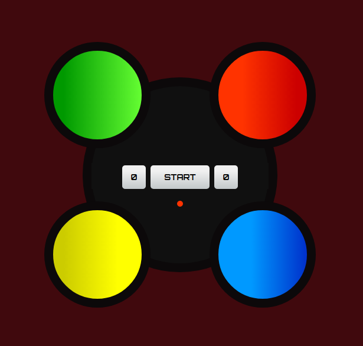

# **The Simon Memory Game**

## **Description**

The Simon electronic memory skill game, invented in 1978 by Ralph H. Baer and Howard J. Morrison,
creates a series of tones and lights and requires a user to repeat the sequence. If the user succeeds,
the series becomes progressively longer and more complex. Once the user fails or the time limit runs
out, the game is over. Gameplay is based on Atari's unpopular Touch Me arcade game from 1974.

## **Features**

The device has four coloured buttons, each producing a particular tone when it is pressed or
activated by the device. 

A round in the game consists of the device lighting up one or more buttons
in a random order, after which the player must reproduce that order by pressing the buttons. 

As the
game progresses, the number of buttons to be pressed increases.

## **Technology Used**


<br />

## Visual Representation Of The Console As Per Client Requirements 


<br /><br />

## End Product

<br /><br />

## **To Run This Project**

```
$ git clone https://github.com/jphoulihan/simon-game-2.0.git
```

## **Game Play**

The Single-Player Simon Game is as follows:

1. Click the START button to begin, the game status indicator (the red/green light below the START
button) switches from RED to GREEN. The game will begin 3s after the light turns GREEN.

2. Simon will give the first signal (randomly flash a coloured buGon). Repeat the signal by clicking the
same colour button.

3. Simon will duplicate the first signal and add one. Repeat these two signals by clicking the same
colour buttons, in order.

4. Simon will duplicate these first two signals and add one.

5. Continue playing as long as you can repeat each sequence of signals correctly. After the 5th, 9th
and 13th signals in a sequence, Simon automatically speeds up the interval between signals.

6. If you fail to repeat a sequence exactly, or if you take more than 5 seconds to repeat a signal,
Simon responds by flashing all four buttons simultaneously five times. This means you have lost,
and the sequence of signals ends. The game status indicator switches from GREEN to RED and you
will have to click START button to begin a new game.

7. Your progress (the number of correctly repeated signals) for the game just completed (last game)
is shown in the display to the right of the START button. The all-time highest score is shown in the
display to the left of the START button.<br /><br />

## **Learning Outcomes**
* DOM Event Listeners
* Asynchronous functions
* Styling as per clients needs with CSS
* jQuery HTML document traversal

## **Future Development**

* Memory peristent layer to record high scores and leader boards
* Account creation
* Start game from a higher level
<br /><br />

## Created by

- [John Houlihan](https://github.com/jphoulihan "Visit John's GitHub")<br/><br/>

## License

[](https://opensource.org/licenses/MIT)

